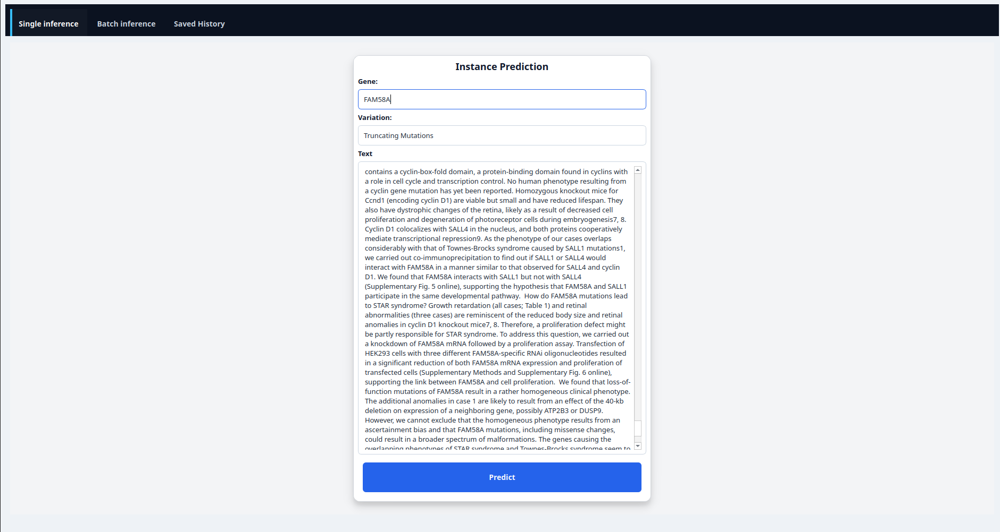
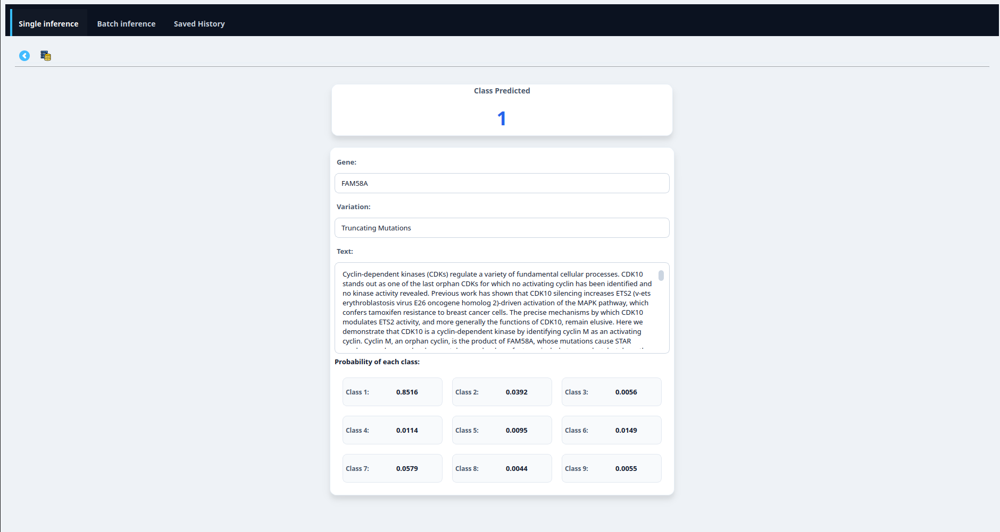
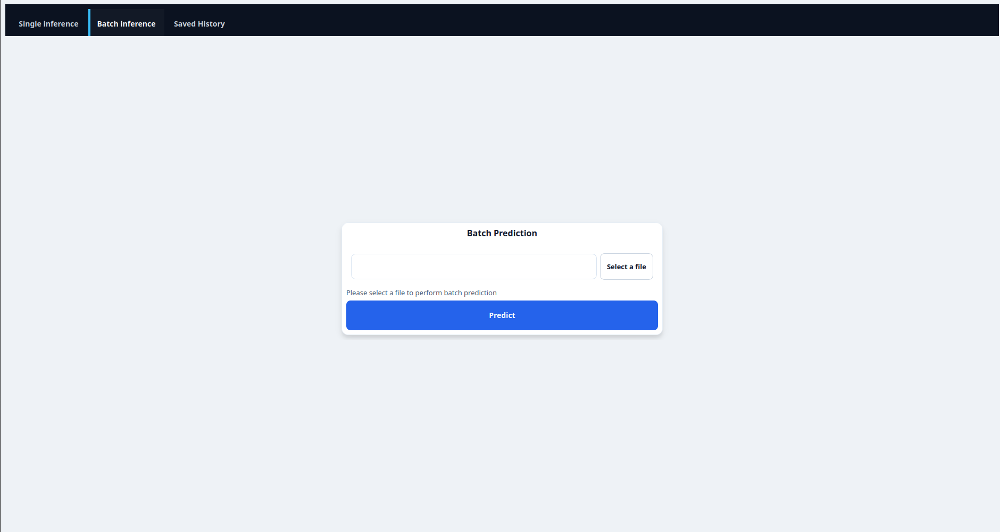
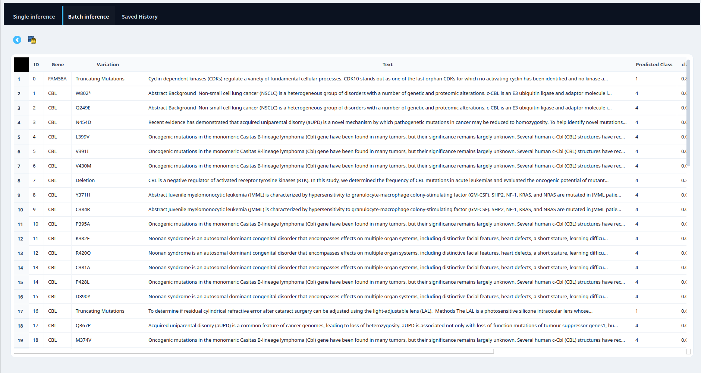
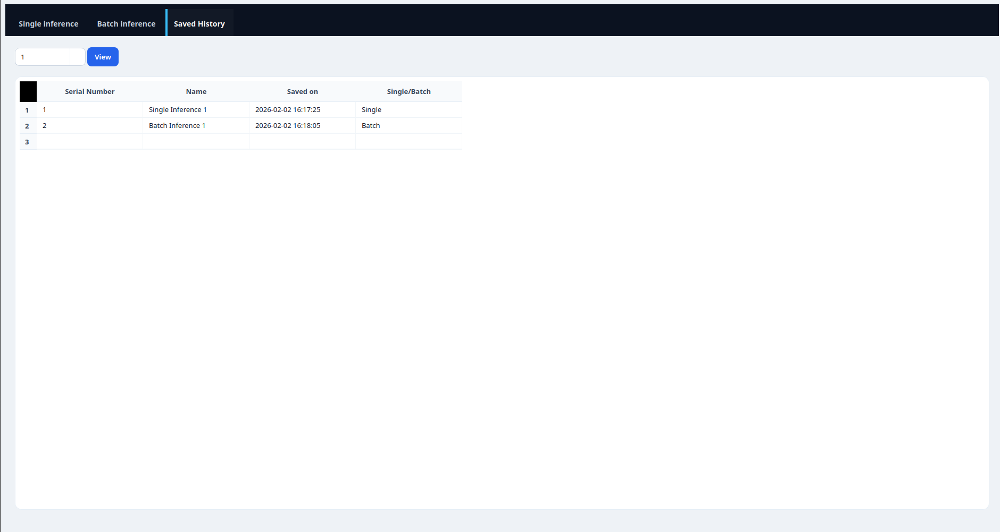

# Cancer Mutation Gene Classifier

**Short description.** A desktop application and ML pipeline that automates classification of genetic variations into clinically meaningful categories (1–9) from literature-derived evidence. The tool is intended to reduce the time a molecular pathologist spends interpreting mutation-level evidence by automating the final classification step using a supervised machine‑learning model.

---

## Table of Contents

* [Project Goal](#project-goal)
* [Features](#features)
* [Data format](#data-format)
* [Tech stack](#tech-stack)
* [Architecture & workflow](#architecture--workflow)
* [Data processing & encoding](#data-processing--encoding)
* [Model](#model)
* [Performance comparison](#performance-comparison)
* [Getting started](#getting-started)
* [Operating the software (UI)](#operating-the-software-ui)
* [Demo] (#demo)
* [Future plans](#future-plans)

---

## Project Goal

Manually classifying mutations as *drivers* or *passengers* from free-text clinical literature is time-consuming. This project automates the final, most time-consuming step (classification) so molecular pathologists only need to:

1. select variations of interest, and
2. collect the supporting evidence (text)

The system then predicts the appropriate class (1–9) for each variation using the provided evidence.

## Features

* Desktop GUI for single and batch inference (PyQt6)
* Single-instance inference with save/load for the result
* Batch inference from CSV uploads and persistent storage of results
* Trained ML pipeline (feature encoding, TF‑IDF for text, logistic regression classifier)
* Model evaluation using log loss and misclassification rate monitoring

## Data format

Input dataset must contain the following columns (CSV or programmatic input):

| Column      |              Type | Description                                                           |
| ----------- | ----------------: | --------------------------------------------------------------------- |
| `ID`        |           integer | Unique identifier for the instance                                    |
| `Gene`      |            string | Gene symbol/name (mutated gene)                                       |
| `Variation` |            string | Textual description of the variant (e.g., `p.V600E`, `c.123_124insA`) |
| `Text`      |            string | Evidence text from literature relevant to the variant                 |
| `Class`     | categorical (1–9) | Target label                                                          |

> Example row (CSV): `123, BRAF, p.V600E, "This mutation has been implicated...", 2`

## Tech stack

* Language: **Python 3.12.3**
* Data libs: **pandas**, **numpy**
* NLP: **nltk**, **scikit-learn** (TF‑IDF)
* ML: **scikit-learn**, **scipy**
* GUI: **PyQt6**, **matplotlib**, **seaborn**
* DB: **sqlite3** (embedded persistence for saved results)

## Architecture & workflow

1. **User selects variants** (manually in the GUI or via a CSV upload).
2. **User attaches / pastes evidence text** for each variant.
3. **Preprocessor** applies text cleaning, stop-word removal, and tokenization.
4. **Encoders**

   * `Gene` → One‑hot encoding
   * `Variation` → response coding / target encoding
   * `Text` → TF‑IDF vectorization
5. **Feature aggregator** concatenates encoded features into a single design matrix.
6. **Model** performs inference (Logistic Regression, class-balanced).
7. **Results** are shown in GUI and may be saved to the embedded SQLite DB for auditing.

## Data processing & encoding

* **Gene**: One‑hot encoding (sparse representation recommended for many genes).
* **Variation**: Response coding (target encoding) — helps capture variant-specific signals when counts are sufficient.
* **Text**: Preprocessing pipeline includes:

  * lowercasing
  * removal of special characters and punctuation
  * stop-word removal (NLTK stop lists)
  * optional stemming/lemmatization (configurable)
  * TF‑IDF encoding (scikit‑learn `TfidfVectorizer`)

All transformers are persisted (e.g., via `joblib`) so production inference uses identical encodings.

## Model

* **Algorithm**: Logistic Regression with class balancing (`class_weight='balanced'`).
* **Monitoring metric**: Log loss (primary) and mis-classification rate (secondary).
* **Checkpointing**: model + vectorizers + encoders saved to disk for reproducible inference.

## Performance comparison

| Model                       |  Log loss | % misclassified |
| --------------------------- | --------: | --------------: |
| Naive Bayes                 |     1.217 |           38.0% |
| K‑NN                        |     1.170 |           37.7% |
| Logistic Regression (final) | **0.995** |       **35.5%** |
| Linear SVM                  |     1.180 |           37.8% |
| Random Forest               |     1.120 |           39.1% |

The logistic regression model provides the best log‑loss and misclassification tradeoff in the experiments above.

## Getting started

**Clone the repository**

```bash
git clone https://github.com/Sonarjit/cancerPrediction.git
cd <repo-folder>
```

**Create a virtual environment**

Windows (PowerShell / CMD):

```powershell
python -m venv venv
# activate
venv\Scripts\activate
```

Ubuntu / macOS:

```bash
python3 -m venv venv
source venv/bin/activate
```

**Download ML Pipeline**


[Download the ML pipeline here](https://drive.google.com/drive/folders/1704nivMjXE_rAI8pPmuecO2Z64SsT2g_?usp=sharing)

* Then cut and paste the pipeline.joblib in ml/

**Install dependencies**

```bash
pip install -r requirements.txt
```


**Run the application**

```bash
python main.py
```

*Notes:*

* Python version tested: 3.12.3
* If you use `pip` inside a venv, it will install into the environment. On some systems `python` maps to Python2 — use `python3` if needed.

## Operating the software (UI)

1. **Single inference UI**



   * Provide `Gene`, `Variation`, and `Text`.
   * Click **Predict** to see the predicted class and model probabilities.
   * Click **Save** to persist the inference to the app database.

2. **Single inference result view**



   * Shows class, probability scores, and the raw input text.
   * Save / Export button to record the inference.

3. **Batch inference UI**



   * Upload a CSV with the required columns.
   * Map columns if header names differ.
   * Kick off batch prediction; progress bar shows processing state.

4. **Batch results view**



   * Paginated result table with per‑row details and save/export options.

5. **Saved results**



   * Browse previously saved runs and inspect full evidence + model output.

## Demo


## Future plans

1. Integrate model matrices and model metadata into the UI (per‑run metrics and model versioning).
2. Add model interpretability 
